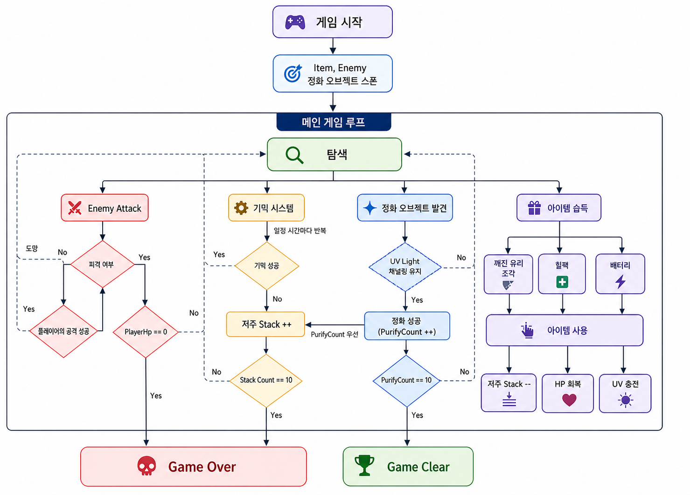
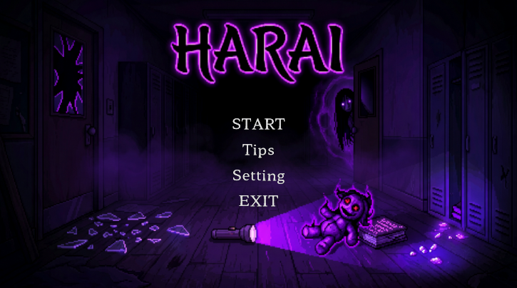
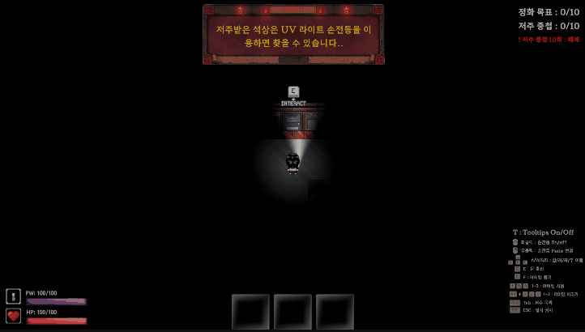
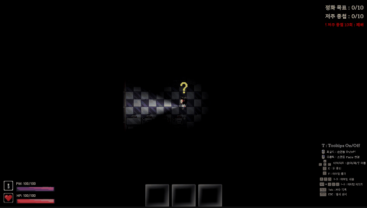
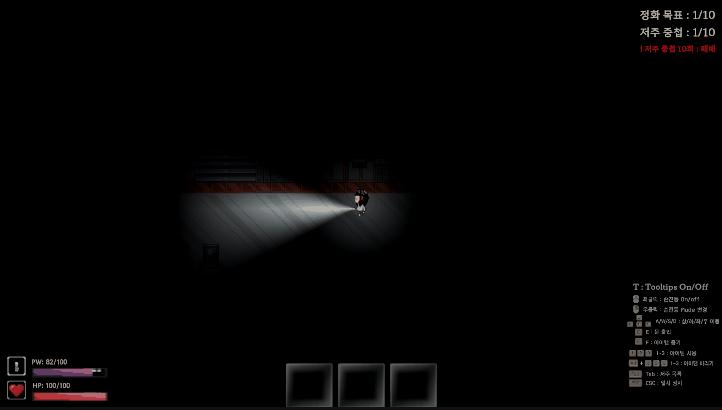

# HARAI

## About The Game

HARAI는 폐교를 배경으로 한 **2D 탑다운 공포 서바이벌 탈출 게임**입니다.  
플레이어는 어둠 속에서 제한된 시야를 극복하고,  
저주받은 물건을 정화하며 생존해야 합니다.

---
## Development

- 기간: 2026.04.08 ~ 2026.04.26
- Name: 홍재희
- 개인 프로젝트

---
## Tech Stack

- **Engine**: Unity 6 (6.3 LTS)
- **Language**: C#
- **Rendering**: URP, Light2D
- **System**: NavMesh, Physics 2D, Input System

---

## Gameplay

플레이어는 다음 흐름을 반복하며 게임을 진행합니다:

> 탐색 → 오브젝트 발견 → 정화 → 저주 발생 → 생존 유지

- 시야는 후레쉬 범위로 제한됨
- 정화 과정은 위험을 동반함
- 저주가 쌓일수록 생존이 어려워짐

---

## System Flow Chart
 

---

## Gameplay Preview
- Title   

- Gameplay   

---

## Controls

| Action | Key |
|------|-----|
| 이동 | WASD |
| 손전등 ON/OFF | 마우스 좌클릭(LMB) |
| 손전등 모드 변경 | 마우스 우클릭(RMB) |
| 상호작용 | E |
| 아이템줍기 | F |
| 아이템 사용 | 1 ~ 3 |
| 아이템 버리기 | 1 ~ 3 |
| 저주 확인 | Tab |
| 일시 정지 | ESC |

---

## Features

### Dynamic Lighting System
- Light2D 기반 제한된 시야
- UV Light를 활용한 특수 상호작용

### Channeling Mechanic
- 일정 시간 유지해야 하는 정화 시스템

### Curse System
- 정화 시 랜덤 디버프 발생
- 누적될수록 난이도 증가

### Enemy AI
- 빛에 반응하는 몬스터
- 상황에 따라 행동 변화

### Event Log UI
- 게임 내 이벤트를 실시간으로 출력

---

## 클리어 조건 및 실패 조건
### 클리어 조건
- 저주받은 물건 10개 정화

### 실패 조건
- 플레이어 HP가 0이 될 경우
- 저주 스택이 10회 이상 쌓일 경우
---

## Build

<!-- 빌드 파일 링크 넣는 곳 -->
<!-- 예시 -->
<!-- https://your-download-link -->

---

